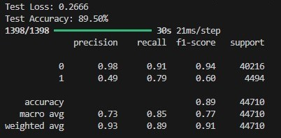
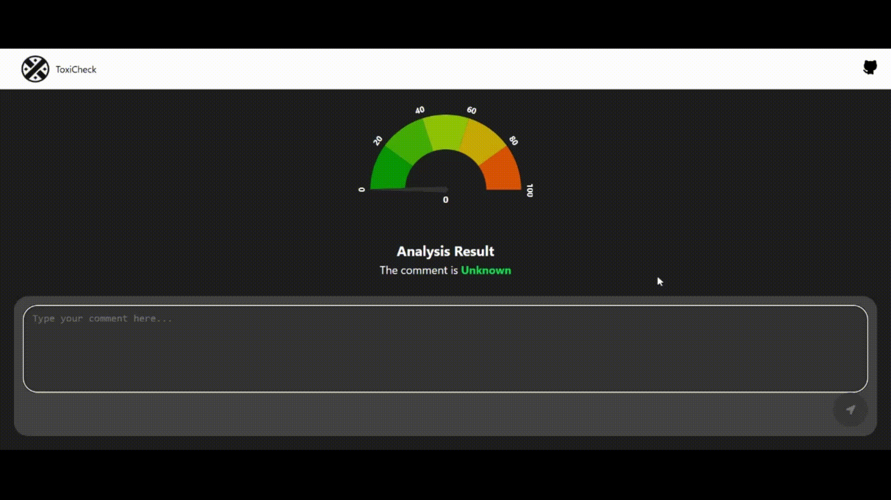
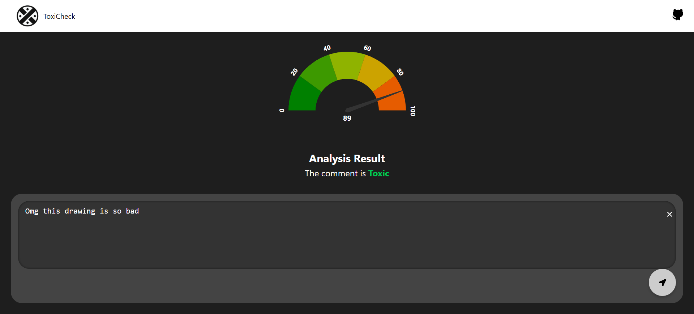
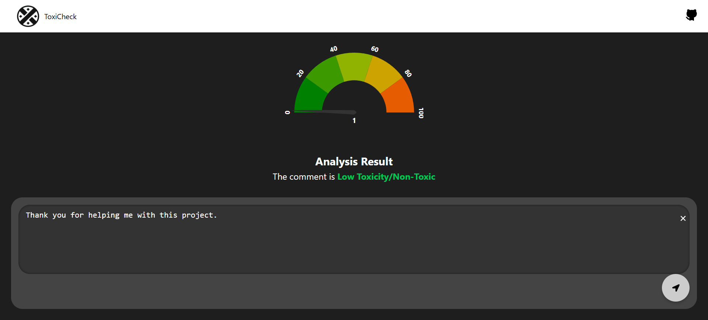

# CPT316-G29-Assignment-2 

# ToxiCheck: A Toxic Comment Classification System


## Table of Contents

1. [Objective](#objective)
2. [Key Components](#key-components)
   - [Machine Learning Model](#1-machine-learning-model)
   - [Backend](#2-backend)
   - [Frontend](#3-frontend)
3. [Challenges Encountered](#challenges-encountered)
4. [Folder Structure](#folder-structure)
5. [How to Run](#how-to-run)
   - [Backend Setup](#backend-setup)
   - [Frontend Setup](#frontend-setup)
   - [Running the Application](#running-the-application)
6. [Test Cases](#test-cases)
7. [Disclaimer](#disclaimer)
8. [Future Enhancements](#future-enhancements)
9. [Demo](#demo)
10. [Screenshots](#screenshots)
11. [Outcome](#outcome)

---

## Objective

Develop a web-based application to classify text as toxic or non-toxic using machine learning, integrating both frontend and backend components. This project is part of **CPT316 Assignment 2**.

---

## Key Components

### 1. Machine Learning Model

- **Model Used**: A CNN-based Keras model trained to classify toxic comments.
- **Data Preprocessing**:
  - Combined multiple toxicity labels (toxic, severe_toxic, obscene, etc.) into a binary classification (toxic or non-toxic).
  - Vectorized text using TF-IDF with 2000 features.
  - Used class weights to handle class imbalance.
- **Model Architecture**:
  - Convolutional layers for feature extraction.
  - Fully connected dense layers for classification.
  - Sigmoid activation for binary output.
- **Training**:
  - Initially tested other models (e.g., Logistic Regression, Random Forest), but their accuracy was lower.
  - Chose the CNN-based architecture due to its better performance on text data.
  - Trained for 20 epochs, which took approximately **6+ hours** on available hardware.
  - Achieved X% accuracy (see screenshot below).
  - Loss function: `binary_crossentropy`.
  - Optimizer: `Adam`.
  - **Note**: The dataset is imbalanced, which may affect real-world performance.
    <div align="center">
    
    </div>

### 2. Backend

- **Framework**: Flask
- **Endpoints**:
  - `/classify`: Accepts text input and returns toxicity classification (toxic/non-toxic) and confidence score.
- **Testing**:
  - API tested using **Postman** to verify functionality.
- **Deployment**:
  - Attempted deployment using free hosting services like Render, but the 512 MB memory limit was insufficient for loading the model.
  - Explored TensorFlow.js conversion for browser compatibility, but conversion failed due to dependency and compatibility issues.

### 3. Frontend

- **Framework**: React + Vite
- **Features**:
  - **Home Page**:
    - Upper section:
      - Displays a half-donut chart indicating toxicity percentage.
      - Shows text results ("Toxic" or "Non-Toxic").
    - Lower section:
      - A chatbox for entering comments.
      - Buttons for Send and Clear (Sound Detect moved to Future Enhancements).
  - **Navigation Bar**:
    - Fully responsive design.
    - Includes a logo, links to GitHub, and navigation to app features.
  - **Styling**:
    - Used CSS for a clean, modern, and responsive design.
    - Integrated with a custom logo.
  - **API Integration**:
    - Fetches results from the Flask backend using Axios.

---

## Challenges Encountered

1. **Render Deployment**:
   - Memory issues due to model size exceeding the 512 MB RAM limit.
   - Path resolution and module loading issues (gunicorn configuration).
2. **TensorFlow.js Conversion**:
   - Deprecated numpy APIs caused conversion failure.
   - Required environment adjustments for compatibility.
3. **Model Testing**:
   - Initial testing in Node.js encountered package compatibility issues (`@tensorflow/tfjs-node`).
   - Resolved by updating and aligning dependencies.
4. **Frontend-Backend Communication**:
   - Ensured alignment between frontend API calls and backend endpoints.

---

## Folder Structure

### Frontend Directory (`frontend/src`)

```
├─assets
│  └─images
├─Component
│  ├─DonutChart
│  ├─Loader
│  └─SpeedMeter
├─Containers
│  ├─Home
│  ├─Navigation
│  │  └─HorizontalNavBar
│  └─Notfound
└─utils
```

---

## How to Run

### Prerequisites

1. **Install Dependencies**:

   - **Python**: Ensure Python (>= 3.8) is installed. [Download Python](https://www.python.org/downloads/)
   - **Node.js**: Install Node.js. [Download Node.js](https://nodejs.org/)
   - **Git**: Install Git. [Download Git](https://git-scm.com/)
   - **Git LFS**: Install Git Large File Storage (LFS). [Download Git LFS](https://git-lfs.github.com/)

2. **Verify Installation**:
   Run the following commands to confirm the tools are installed:
   ```bash
   python --version
   node --version
   npm --version
   git --version
   git lfs --version
   ```

---

### Step 1: Clone the Repository

1. Open your terminal and clone the repository:
   ```bash
   git clone https://github.com/JackyChung2003/CPT316-G29-Assignment-2.git
   ```
2. Navigate to the project directory:
   ```bash
   cd CPT316-G29-Assignment-2
   ```

---

### Step 2: Handle Large Files (Git LFS)

1. **Install Git LFS (if not installed)**:
   ```bash
   git lfs install
   ```
2. **Download the large files**:
   ```bash
   git lfs pull
   ```
3. **Wait for the large files to download**:
   - The process may take a few minutes depending on your internet speed.
   - You can verify the large files are downloaded:
     ```bash
     git lfs ls-files
     ```

---

### Step 3: Backend Setup

1. Navigate to the `backend` directory:
   ```bash
   cd backend
   ```
2. Install Python dependencies:
   ```bash
   pip install -r requirements.txt
   ```
3. Start the Flask server:
   ```bash
   python app.py --model toxic_comment_cnn.h5 --vectorizer tfidf_vectorizer.pkl --port 5000
   ```
4. (Optional) Preprocess data and retrain the model:
   - Use `data_preprocessing.py` for data preparation.
   - Use `train_model.py` to train the model.

---

### Step 4: Frontend Setup

1. Navigate to the `frontend` directory:
   ```bash
   cd ../frontend
   ```
2. Install Node.js dependencies:
   ```bash
   npm install
   ```
3. Start the development server:
   ```bash
   npm run dev
   ```

---

### Step 5: Run the Application

1. Open the React app in your browser:
   - The default URL is usually: [http://localhost:5173](http://localhost:5173)
2. Use the chatbox to enter comments and analyze their toxicity.
3. Monitor the Flask backend in a separate terminal:
   - The backend runs at: [http://127.0.0.1:5000](http://127.0.0.1:5000)

---

### Additional Notes

- **Handling Errors**: If you encounter errors during setup, check that all dependencies are installed and the Git LFS files are fully downloaded.
- **Git LFS Verification**: Run the following command to list large files:
  ```bash
  git lfs ls-files
  ```

---

## Disclaimer

- The focus of this project is on the **integration and paradigm** rather than training a highly accurate model.
- The training dataset is imbalanced, which may affect real-world performance.

---

## Future Enhancements

1. **Deployment**:
   - Optimize Flask backend for deployment on platforms like Heroku or AWS Lambda.
2. **Frontend Improvements**:
   - Add real-time voice-to-text conversion for the chatbox.
   - Enhance the UI/UX with better visualizations.
3. **Model Optimization**:
   - Quantize or compress the model to reduce memory usage.
   - Address dataset imbalance with data augmentation or re-sampling techniques.
4. **Advanced Features**:
   - Add a feature for users to upload files or batch comments for analysis.

---

## Demo



---

## Screenshots

### User Interface

- **Home Page with Toxic Result**:



- **Low Toxicity Result**:



---

## Outcome

The project is on track to achieve its goal of creating a web-based toxic comment classification system. While challenges in deployment and TensorFlow.js conversion remain, the backend and frontend are integrated and functional locally. Future improvements focus on deployment and optimizing the user experience.
